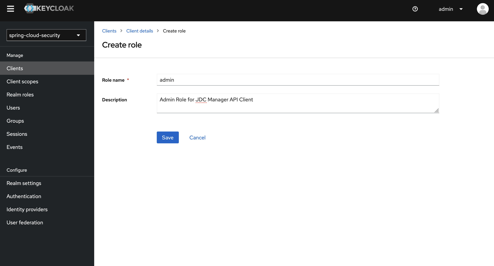

# Keycloak Server
Keycloak is an Open Source Identity and Access Management solution for modern Applications and Services.

Keycloak offers features such as Single-Sign-On (SSO), Identity Brokering and Social Login, User Federation, Client Adapters, an Admin Console, and an Account Management Console.

## Server Installation

Docker Compose File
```
version: '3'

volumes:
  postgres_data:
    driver: local

services:
  db:
    image: postgres:latest
    volumes: 
      - postgres_data:/var/lib/postgresql/data
    environment:
      POSTGRES_DB: keycloak_db
      POSTGRES_USER: keycloak
      POSTGRES_PASSWORD: keycloak
    ports:
      - 5432:5432
  kc:
    image: quay.io/keycloak/keycloak:latest
    environment:
      DB_VENDOR: postgres
      DB_ADDR: db
      DB_SCHEMA: public
      DB_DATABASE: keycloak_db
      DB_USER: keycloak
      DB_PASSWORD: keycloak
      KEYCLOAK_ADMIN: admin
      KEYCLOAK_ADMIN_PASSWORD: admin 
      KC_HOSTNAME: localhost
    ports:
      - 8080:8080
    depends_on:
      - db
    command: 
      - start-dev
```

Starting up 
```
docker-compose up -d
```

## Configuration in Keycloak Server

1. Realm Settings
2. Create Client
3. Role Configurations
4. Create User

### 1. Realm Setting

Realm is a set of User, Roles and Password and so on. 

After sign in to Keycloak admin web application, we have to create a realm to use authorization service.


Press Create Realm Button to create a new realm.


Enter Realm Name and Press Create Button to create a realm.


After create a realm, we can configure details information from Realm Settings Menu from Side Bar.

### 2. Create Client

Keycloak is served as OAuth2 Authorization Server for MicroServices Application. 

Clients are entities that can use Keycloak for user authentication. Typically, clients are applications that redirect users to Keycloak for authentication in order to take advantage of Keycloak’s user sessions for SSO.

We can create Client from Clients Management View of specific realm.


After pressing Create Client Button, we can create a new client from Create Client View.


We can configure client general information from General Settings View. Select Client Type, and enter Cliend ID you can press Next Button. 

Name and Description are optional information.


If we don't need to control client access, we can use default capability config. And then press next button.


If we are writing Spring MVC Application, we have to enter all these url. After that press Save button to save a new client.


We can also change client configurations from Client Details View.

### 3. Role Configurations

Keycloak support Role Base Security, and can be defined Roles from Admin Web Application. There are mainly two types of roles, Roles for Realm and Roles for Client Application. 

And also Roles can be composed as a single role.


Role for Realm can be managed from Realm Role Sub Menu. You can create a new role for target realm by pressing Create Role Button.


Role for Client Resource Applications can be managed from Role Table of specific client configuration.


You can also create a new role for Client Resources Applications.



Role composition can be defined by adding Associate Roles.


### 4. Create User


## Using REST Endpoint

1. Generate Token
2. Referesh Token
3. Sign Up New User